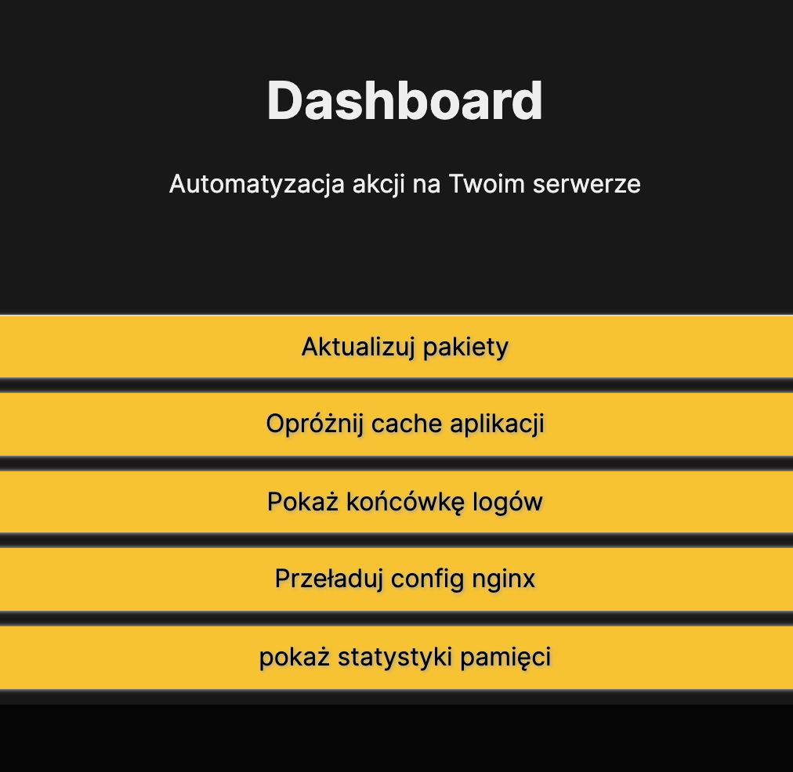

# Dashboard

Dashboard to prosta aplikacja, która umożliwia uruchamianie zdefiniowanych (przez Ciebie) poleceń na Mikrusie przy użyciu jednego kliknięcia.

Najprościej jest porównać tę usługę do pilota od TV. Masz tam wiele przycisków, a każdy z nich realizuje pewien cel. Możesz np. przypisać akcję aktualizacji systemu do pierwszego przycisku, restart Apache do drugiego, a np. operację ’git pull’ do trzeciego. Dzięki takiej konfiguracji jesteś w stanie zarządzać serwerem (a przynajmniej najczęstszymi operacjami) bez logowania się na VPSa.

Przykładowy dashboard stworzony przez użytkownika może wyglądać np. tak:

[Powrót do strony głównej](/)