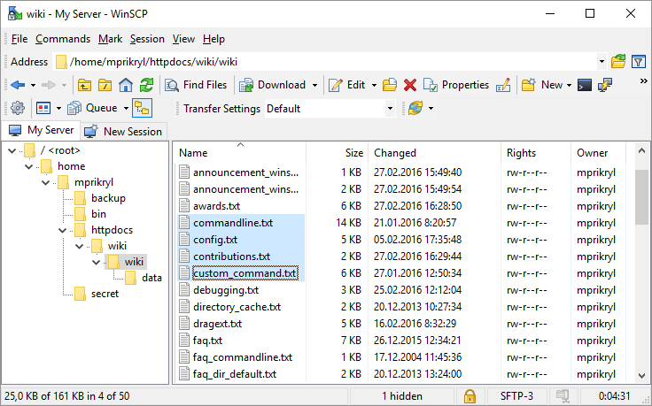
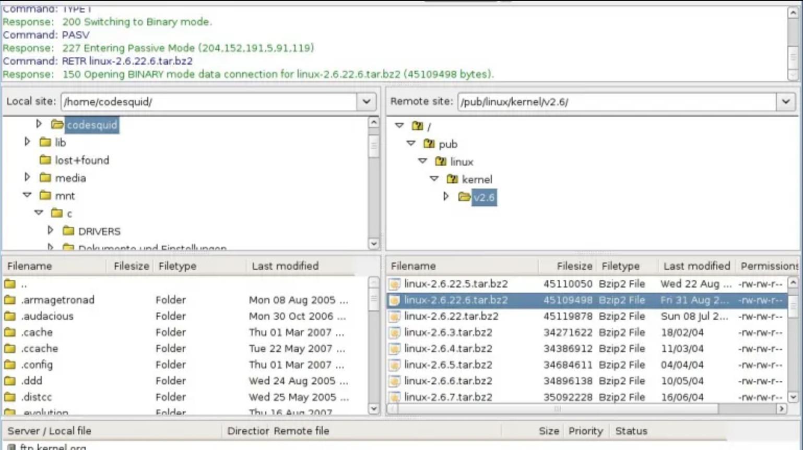

# Jak wysyłać pliki na Mikrusa?

Sugerowanym rozwiązaniem przy uploadzie plików na serwer jest użycie SCP.

Aby skorzystać z SCP, potrzebujesz znać następujące rzeczy:

- na którym serwerze masz VPSa? np. **srv08.mikr.us**
- jaki jest Twój numer portu SSH? np. **10999**

Jeśli lubisz pracować w terminalu i do tego masz zanstalowane narzędzie 'scp', to wystarczy wydać następujące polecenie.

```bash
scp -P 10999 /sciezka/na/twoim/dysku/plik.zip root@srv08.mikr.us:/sciezka/na/serwerze/
```

## Windows

Jeśli jesteś użytkownikiem **Windowsa** i lubisz programy okienkowe, to zainstaluj **WinSCP**

[https://winscp.net/eng/download.php](https://winscp.net/eng/download.php)



Przy konfiguracji połączenia w WinSCP podaj dokładnie te same dane, które podajesz przy połączeniu SSH.

## Linux - graficznie

Zalecaną aplikacją do graficznego przesyłania plików dla Linuksa jest Filezilla

[https://filezilla-project.org/download.php?type=client](https://filezilla-project.org/download.php?type=client)



Jeśli bardzo zależy Ci na dostępie FTP do VPSa, to masz dwie opcje:

1. Zainstaluj sobie serwer FTP. Z tych najprostszych w konfiguracji będzie to Proftpd
2. Aktywuj usługę [Cytrus](/cytrus), a wtedy będziesz mógł korzystać ze współdzielonego serwera FTP.

[Powrót do strony głównej](/)