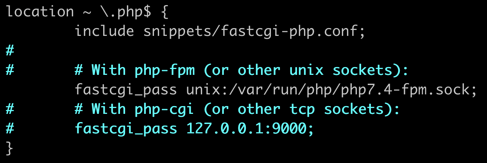

# NginX + PHP + MySQL

Aby postawić stack LEMP, postępuj według poniższej instrukcji

Na początek zaktualizuj pakiety w systemie

```bash
apt update
```

Następnie zainstaluj wymagane pakiety

```bash
apt install nginx php-fpm mariadb-server
```

Serwer już stoi. Czas aktywować PHP.

Edytuj plik **`/etc/nginx/sites-enabled/default`** i spraw, aby poniższy fragment wyglądał w nim jak na obrazku poniżej, dopasowując swoją wersję PHP, np. **php8.4-fpm.sock** 👇 



Zrestartuj nginx

```bash
service nginx restart
```

To w zasadzie wszystko - teraz wypadałoby tylko [podpiąć własną domenę przez Cloudflare](../podpiecie_domeny_przez_cloudflare), [wyklikać sobie darmową w panelu](https://mikr.us/panel/?a=domain) lub [szybko uzyskać ją z VPS-a](../szybka_subdomena).

Aby przetestować działanie PHP, wpisz poniższe polecenie, a następnie odwołaj się do pliku test.php przez przeglądarkę.

```bash
echo "<?php phpinfo(); " > /var/www/html/test.php
```

- Do postawienia bazy danych użyj [oddzielnego poradnika](../konfiguracja_mysql_mariadb)
 - Przeczytaj także o tym [jak wysyłać pliki na Mikrusa](../jak_wysylac_pliki_na_mikrusa) 

[Powrót do strony głównej](/)
