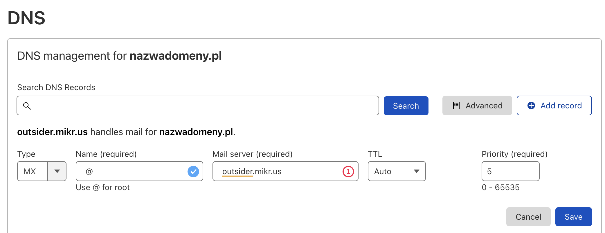
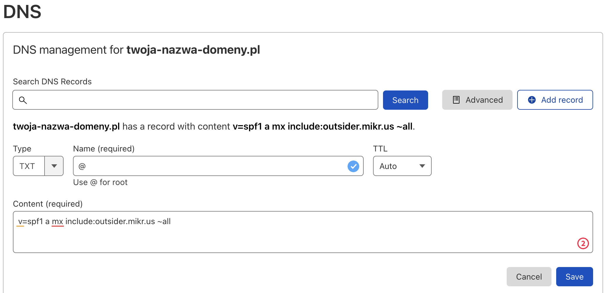
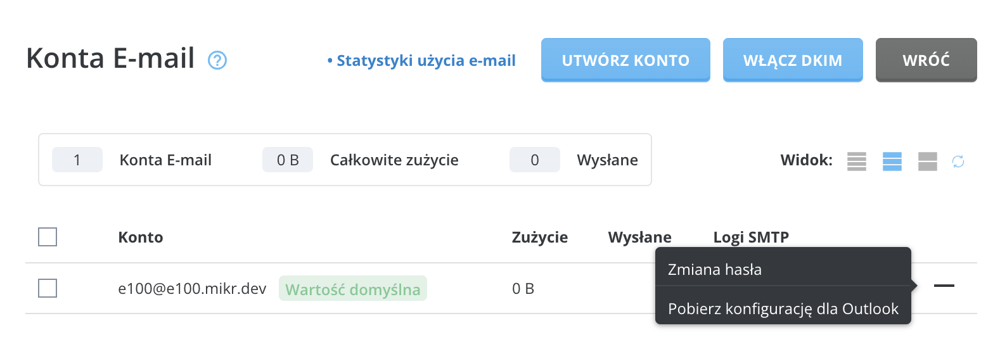
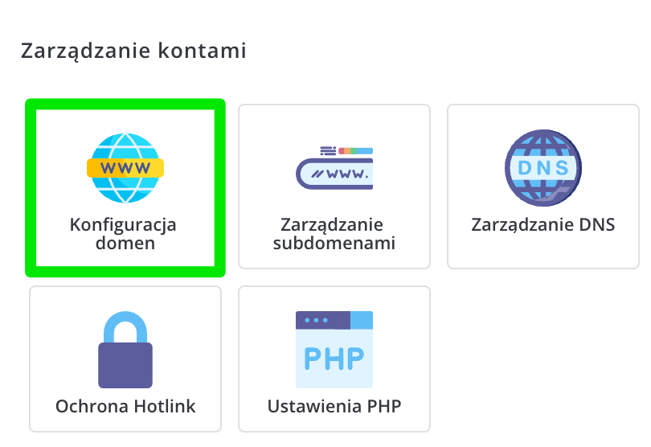
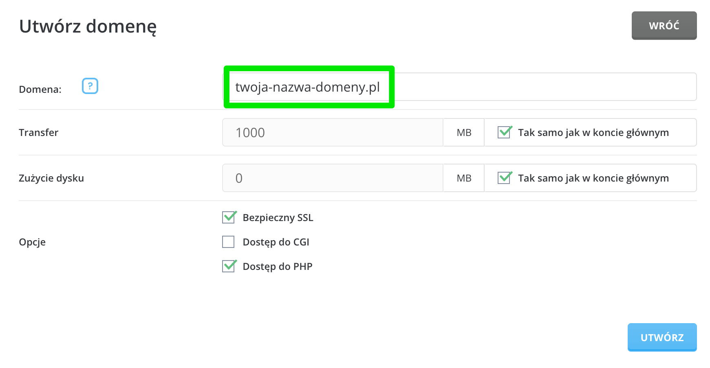
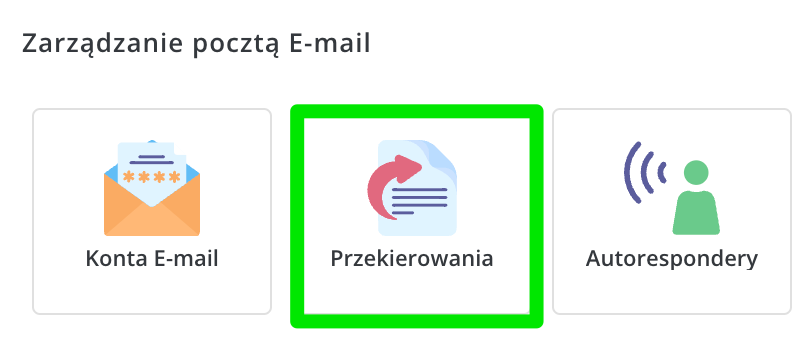
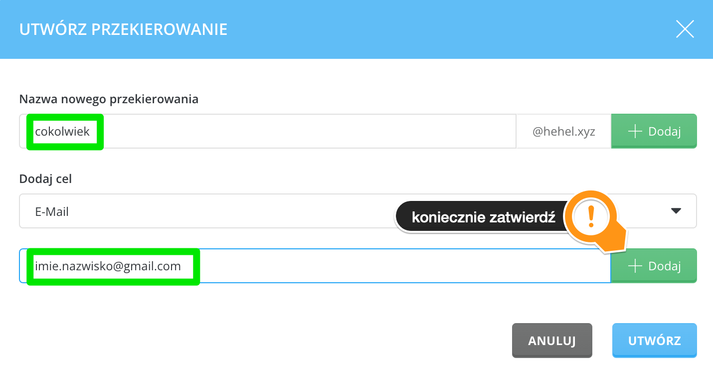

# Outsider

Outsider to zewnętrzny serwer z zainstalowanym DirectAdminem, do którego masz dostęp od Mikrusa 2.0 wzwyż.

Dlaczego taka usługa powstała?

Na Mikrusie nie da się postawić serwera pocztowego ani serwera DNS. Outsider daje Ci możliwość korzystania z tych usług. Możesz założyć tam dowolną liczbę skrzynek pocztowych, a nawet dodać własną domenę do DNSa i nią zarządzać.

Co więcej, usługi uruchomione na Outsiderze nijak nie obciążają Twojego głównego serwera, a przestrzeń zajmowana na Outsiderze nie jest wliczana do Twojej quoty.

Serwer, o którym mowa działa jak klasyczny hosting współdzielony. Jeśli zechcesz, to możesz na nim równie dobrze postawić bazę MySQL i zainstalować WordPressa (co do instalacji, to mamy Softaculusa, czyli instalacja WP to dosłownie 2-3 kliknięcia).

## Jak zalogować się do panelu?

Link: [https://outsider.mikr.us:2222](https://outsider.mikr.us:2222/) 

Loginem jest nazwa Twojego serwera np. x921

Hasło otrzymasz przy aktywacji usługi w panelu Mikrusa (będzie w logach operacji).

## Jak dodać nową domenę do Outsidera (WWW+poczta)?

1. Zaloguj się do panelu 
2. Kliknij “Konfiguracja domen”
3. Wybierz “Dodaj”
4. Zdefiniuj nazwę i gotowe

Następnie musisz wycelować swoją domenę poprzez rekord DNS o nazwie “A” lub CNAME w Outsidera.

- Dla rekordu ‘A’ podaj adres IP jaki ma serwer (możesz go pobrać np. pingując go, czy używając narzędzi dig/host)
- Dla rekordu CNAME wpisz po prostu ‘outsider.mikr.us’


> 💡 Jeśli planujesz hostować na Outsiderze tylko pocztę (lub przekierowanie poczty), to ustawianie rekordów A/CNAME jest zbyteczne. Wystarczy jedynie MX (instrukcja poniżej).

## Jak hostować pocztę na Outsiderze?

Musisz posiadać własną domenę (nasza darmowa nie zadziała), a następnie w ustawieniach DNS u swojego dostawcy domen dodaj do domeny serwer MX o wartości (priorytet dowolny, może być np. 5):

**`outsider.mikr.us`**

Jeśli wcześniej były tam inne wpisy MX, to usuń je.

W przypadku Cloudflare może to wyglądać tak:



Dodaj (ale jest to krok opcjonalny) **wpis SPF** dla swojej domeny:



Wartość wpisu to:

```
v=spf1 a mx include:outsider.mikr.us ~all
```

Jeśli wraz z pocztą chcesz hostować także strony WWW, to musisz jeszcze wygenerować wymagane certyfikaty SSL dla swojej domeny:

1. W panelu Outsidera kliknij “Certyfikaty SSL”
2. Zaznacz dodaną domenę, dla której chcesz obsługiwać pocztę (dodałeś ją w punkcie poprzednim na temat podłączania domeny do outsidera)
3. Kliknij “Ponów”

**Zmiany w DNS zajmują sporo czasu** - zanim zgłosisz, że wysyłanie lub odbieranie maili nie działa, odczekaj minimum 48 godzin.

Jako serwery IMAP, POP3, SMTP itp. podajesz po prostu [outsider.mikr.us](http://outsider.mikr.us) lub swoją darmową domenę \*.mikr.dev.

## Jak wysyłać maile z Mikrusa przez Outsidera?

Zainstaluj aplikację **SSMTP** i **mailtools**

```bash
apt install ssmtp mailutils
```

Następnie w pliku **`/etc/ssmtp/ssmtp.conf`** dodaj odpowiednią konfigurację (wstaw tam oczywiście swoje dane):

```bash
root=user@twoja-domena.pl
mailhub=smtp.**x999**.mikr.dev:587
rewriteDomain=twoja-domena.pl
hostname=dowolna-domena (i tak będzie nadpisana)
FromLineOverride=NO
AuthUser=user@twoja-domena.pl
AuthPass=xxxxxxxxx
```

Sprawdź, czy wysyłanie wiadomości działa z Mikrusa

```bash
echo 'treść wiadomości' | mail -s "to jest temat" user@domena.pl
```

## Jak przechwycić wszystkie maile trafiające na domenę?

Opcja której szukasz nazywa się ‘**Catch-All**’ i sprawia ona, że wiadomości wysłane na cokolwiek@domena.pl trafią na wskazane przez Ciebie konto mailowe.

1. W sekcji “****Funkcje zaawansowane”**** wybierz “**Usługa Catch-All E-mail**”.
2. Z dostępnych opcji wybierz ostatnią (’Adres’) i wpisz tam gdzie mają trafiać wszystkie maile skierowane do nieistniejących skrzynek w ramach Twojej domeny

## Jak skonfigurować swój program pocztowy do współpracy z Outsiderem?

1. W panelu Outsidera wybierz opcję ”Konta E-mail”
2. Koło wybranego konta (które wcześniej musisz założyć) kliknij znak plusa i pobierz konfigurację dla Outlooka

Nawet jeśli nie korzystasz z Outlooka, to plik, który ściągasz to zwykły plik tekstowy. Otwórz go w dowolnym edytorze tekstu i zobacz, jak wyglądają ustawienia poczty.



## Jak ustawić przekierowanie poczty na Outsiderze?

> 🛑 Przed przystąpieniem do konfiguracji przekierowań, wykonaj kroki z rozdziału “***[Jak hostować pocztę na Outsiderze?](#jak-hostować-pocztę-na-outsiderze)***” (ustawienia MX w DNS)

Zaloguj się do panelu Outsidera i dodaj w nim nową domenę. Musisz to zrobić, nawet jeśli nie planujesz hostować u nas strony WWW, a jedynie samą pocztę lub przekierowanie.



Wpisz tam nazwę swojej domeny. Wszystkie pozostałe opcje będą w przypadku poczty zbyteczne.



W prawym górnym rogu ekranu zmień aktywną domenę na tę, którą właśnie dodałeś.


Teraz przejdź do sekcji zarządzania przekierowaniami



Kliknij opcję dodawania przekierowania


Teraz czas na ustawienie właściwego przekierowania.



Gotowe! Twoje przekierowanie powinno zacząć działać poprawnie.

[Powrót do strony głównej](/)