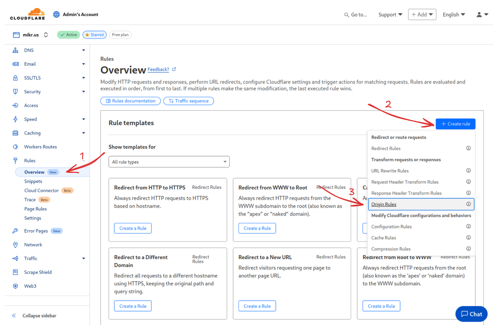
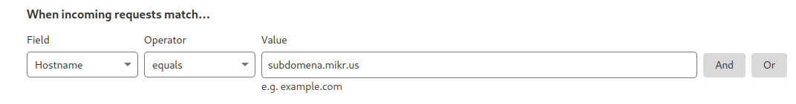
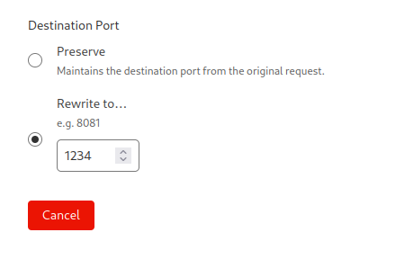

# Zmiana portu używanego przez domenę w Cloudflare

> 💡  Do wykonania tego wymagane jest wcześniej ***[podpiecie domeny przez cloudflare](/podpiecie_domeny_przez_cloudflare)***

W panelu cloudflare będąc na stronie konfiguracji domeny (tam gdzie dodałeś wpis DNS) z menu po lewej stronie wybierz ***Rules*** -> ***+ Create rule*** -> ***Origin Rules***

Następnie wybierz `Hostname` `equals` `subdomena.twoja-domena.pl`

A na dole strony zmień z ***Preserve*** na ***Rewrite to...*** oraz wpisz port na którym działa twoja aplikacja.

A na końcu strony kliknij ***Deploy*** by wprowadzić zmiany. Będą one widoczne w ciągu kilku sekund.

Krótki film pokazujący jak to zrobić od początku do końca:


[Powrót do strony głównej](/)
